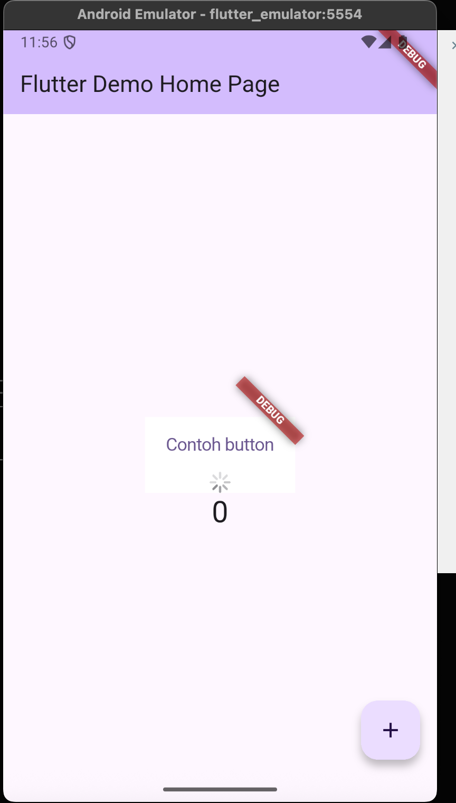

# Flutter Practicum Results

## Practicum 1
Code:
```dart
import 'package:flutter/material.dart';

void main() {
  runApp(const MyApp());
}

class MyApp extends StatelessWidget {
  const MyApp({super.key});

  @override
  Widget build(BuildContext context) {
    return const MaterialApp(
      home: Scaffold(
        body: Center(
          child: Text("contoh"),
        ),
      ),
    );
  }
}
``` 


## Practicum 2
Because my phone is iphone i used android emulator from android studio 

```dart 
// Just running the default Flutter counter app on Android emulator
import 'package:flutter/material.dart';

void main() {
  runApp(const MyApp());
}

class MyApp extends StatelessWidget {
  const MyApp({super.key});

  @override
  Widget build(BuildContext context) {
    return MaterialApp(
      title: 'Flutter Demo',
      theme: ThemeData(primarySwatch: Colors.blue),
      home: const MyHomePage(title: 'Flutter Demo Home Page'),
    );
  }
}
```


## Practicum 4

### Text Widget


### Image Widget


## Practicum 5

### Loading Cupertino Widget


### Fab Cupertino Widget
Because there is an errors while run ```main.dart``` using ```fab_widget.dart``` from lab code, so i'm fixed the code using my own fab component but still using Capurtino


### Scaffolding Widget


### Dialog Widget


### Text Field Widget


### Datetime Picker Widget
